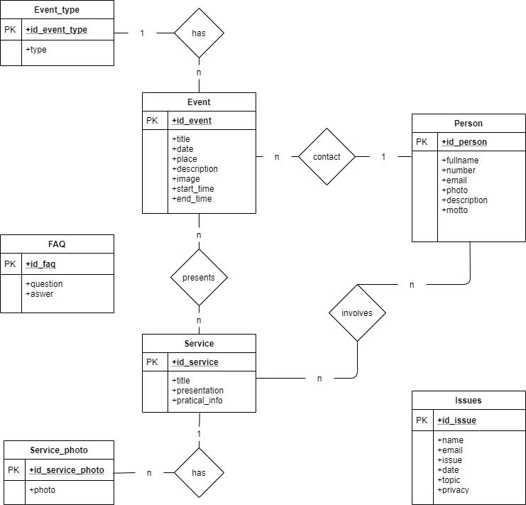

# Documentation of the Backend part
> Deliverable D1
## General group information
| Member n. | Role | First name | Last Name | Matricola | Email address |
|-----------|---------------|------------|-----------|-----------|-----------------|
| 1 | administrator | Alessandra | Pasini | 920051 | alessandra.pasini@mail.polimi.it |
| 2 | member | Stefano | Bagarin | 945159 | stefano.bagarin@mail.polimi.it |

## Links to other deliverables
- Deliverable D0: the web application is accessible at [this address](https://wild-care.herokuapp.com).
- Deliverable D2: the YAML or JSON file containing the specification
of the app API can be found at [this address](https://wild-care.herokuapp.com/backend/spec.yaml). TODO
- Deliverable D3: the SwaggerUI page of the same API is available at
[this address](https:///wild-care.herokuapp.com/backend/swaggerui). TODO
- Deliverable D4: the source code of D0 is available as a zip file at
[this address](https://example.com/backend/app.zip). TODO
- Deliverable D5: the address of the online source control repository
is available [this address](https://github.com/alepas/hypermidia-project). We hereby
declare that this is a private repository and, upon request, we will
give access to the instructors.
## Specification
### Web Architecture
The data layer is implemented though a `PostgreSQL` database, which contains the application data.
The application layer is implemented through the backend software, where the business logic inhabit. This component exposes a REST API (under the endpoint `/v1`) to enable the interaction with frontend.
The presentation layer is implemented through the frontend component, which contains the logic to load data from the REST API and render the web pages on client side.

### API

#### REST compliance
Describe here to what extent did you follow REST principles and what are
the reasons for which you might have decided to diverge. Note, you must
not describe the whole API here, just the design decisions. TODO?

#### OpenAPI Resource models
We have used the $ref mechanism to define some general models:

* `Event`
* `Service`
* `Volunteer`
* `Photo`
* `Photo`
* `Faq`
* `request`

Then with the same mechanism, we defined some _expanded_ models that contains all information and related entities:

* `Event` → `ExpandedEvent` (contains related `Volunteer`, `Service` and all event information)
* `Service` → `ExpandedService` (contains related `Volunteer`, `Event` and all service information)
* `Volunteer` → `ExpandedVolunteer` (contains related `Event`, `Service` and all all volunteer information)

### Data model

Most of those relations map seamlessly to REST resources, but there are few considerations:

* The _expanded_ resources live into the db for what concern the resource detailed information, but they don't for what concern other entities data which are the result of joined queries.
* There is just one POST and it is related to the contact form. The OpenAPI model is called `request`, while the db table is called `Issues`.

We first created the db tables using `Knex` library and than we fullfill them from `pgAdmin 4`.

## Implementation
### Tools used
The technology stack is composed by:

* `Javascript` on `NodeJS` runtime
* `Postgres` RDBMS
* `Javascript` on frontend

For the backend component we used:

* `knex`: a "batteries included" SQL query builder for Postgres designed to be flexible and portable.

### Discussion  //TODO
Describe here:
- How did you make sure your web application adheres to the provided
OpenAPI specification? Which method did you use to test all APIs
endpoints against the expected response?
- Why do you think your web application adheres to common practices to
partition a REST-based web application (static assets vs.
application data)
- Describe synthetically why and how did you manage session state,
what are the state change triggering actions (e.g., POST to login
etc..).
- Which technology did you use (relational or a no-SQL database) for
managing the data model?

## Other information

### Task assignment
Alessandra Pasini and Stefano Bagarin worked together at the same time on both front-end and back-end (we live together):
> - Alessandraworked on front end (50%) and OpenAPI Spec (50% of the time)
> - Stefano worked on front end (50%) and OpenAPI Spec (50% of the time)

### Analysis of existing API //TODO
Describe here the research of (full or part of) existing APIs that are similar
in objectives and scope to the one implemented, that have possibly guided
implementation choices (these should not be necessarily OpenAPI
implementations). Toy APIs (such as the Swagger's Pet Store) or the example
shown during lectures are not a valid response.
Use TWO or more items of the form:
> We took (full/partial) inspiration from API <XYZ>(link) for the part of the
> API that manages <ABC> because of <REASON>.
Or
> For the part of the API that manages <ABC> we considered/studied <XYZ>(link)
> because of <REASON> but wasn't completely fitting to our purpose because of
> <REASON>.
  
### Learning outcome
Because of the fact that we worked together almost for the whole project we have been able to achieve the following same goals:
* design end implement a usable and meaningful REST API
* use Swagger 
* learn to deploy on a cloud platform
* design a web page using Web technoques and popular libraries
* impelement a complete web application
 
